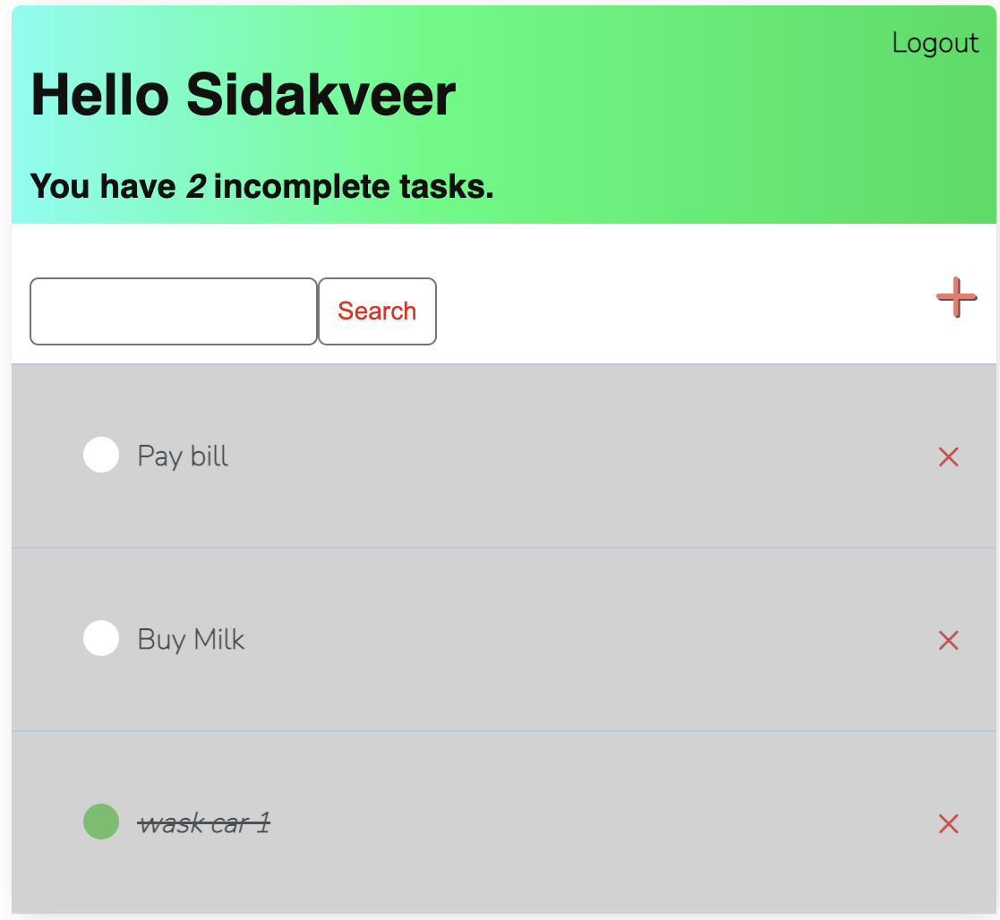

# Todo_List (Django Framework)

 

## Introduction
### In this repository we have created a todo list by:
* Creating a virtual environment and project directory.
* Installing and testing django. 
* Start parent project and create an app using command line operations. 
* Defining data models to create our database.
* Adding create, update and delete functionality.
* User_Authentication: Setting up login and registration for different users.
* Work with in-build django admin interface.
* Creating class based views and templates for frontend. 
* Html and CSS to create and style our website pages.

 

 

## Description
### Website which helps users to register and login to create their own todo list.

 

### Users can update (POST method) their info on a particular task.

 

### Deleting any tasks selected

 

## Login/Register
### Users are asked to login before they can access the website and if a user has not created their account they are able to register a new account to the database.

 

